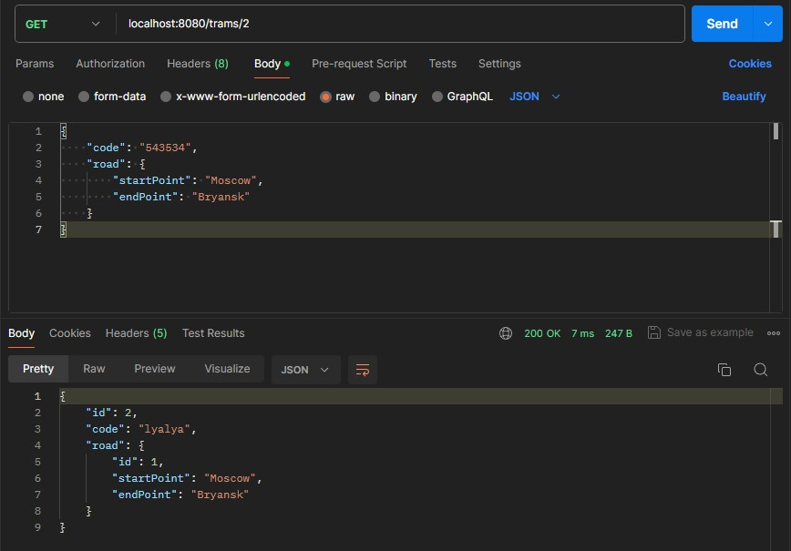

# TramsDemo

Привет! Представляю вам REST Full API **"Trams"**.

> **Стек технологий:** Spring Data JPA, Lombok, H2 Database, Spring Web, hibernate.
*База данных - H2 так как Docker для поднятия БД не используется.*

**Инструкция к выполнению:**
- /trams  get  запрос - получение всех маршрутов
- /trams/id  get  запрос – получение маршрута по  id
- /trams  post  запрос – сохранение в бд маршрута, в  response  –  ID  маршрута
- /trams/id  delete  запрос
- /trams/id  put  или  patch  запрос – в  response  обновлённая запись по маршруту

Есть 2 сущности **Tram** с информацией о маршруте и **Road** с двумя полями (информация начальной станции и конечной).

Пример post и get запросов:

upd. добавлен web controller с простой реализацией создания маршрутов и их отображения на главной странице.
localhost:8080/web

Стили прикрутил на скорую руку дабы закончить MVP, поэтому не обращаем внимания